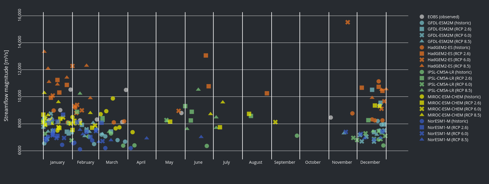
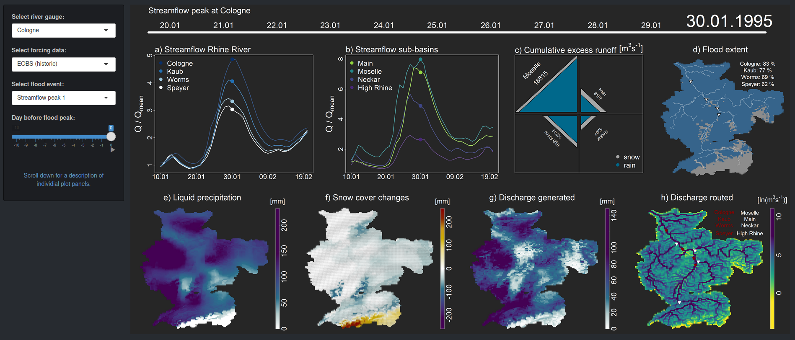

#In-depth analysis of past, present and future flood formation in the Rhine River Basin

### Summary

Shiny dashboard that enables the in-depth analysis of past, present and future flood formation in the Rhine River Basin. The genesis of riverine floods in large river basins often is complex. Streamflow originating from precipitation and snowmelt and from different tributaries can superimpose and cause high water levels threatening cities and comunities residing along the river banks. In the framework of this study, we provide detailed insights into the genesis of historic and future streamflow peaks in the Rhine River Basin. Investigations base on hydrological simulations using the mesoscale Hydrolgical Model [mHM](https://www.ufz.de/index.php?en=40114). We force mHM with historic meteorological data based on observations and data from five different global climate models (GCMs). With regard to the GCMs, we distinguish between simulations under historic climate conditions and projected future conditions based on representative concentration pathways (RCPs). A detailed description of the model simulations analysed in this study can be found in [Rottler et al. 2020](https://doi.org/10.5194/hess-2020-605). For each meteorological forcing, we determine the ten highest runoff peaks at four locations along the Rhine River, i.e., Cologne, Kaub, Worms and Speyer, and analyse the genesis of the peak in detail. River gauges selected are located before/after the confluence of the Rhine River with one of the main triburaries Neckar, Main or Moselle. The in-depth analyis of the streamflow peak genesis includes the assessment and visualization of liquid precipitation, snow cover changes, runoff generated, flood extent and the excess runoff from the High Rhine, Neckar, Main and Moselle up to ten days before the streamflow peak.
       
### Overview figures on streamflow peak characteristics (using [plotly](https://plotly.com/r/))

          

### Interactive in-depth analysis of peak flow formation

 

### Authors and Contact

This analysis was conducted by Erwin Rottler (member of the working group Hydrology & Climatology, University of Potsdam) in the framework of investigations focusing on future changes Rhine River flood seasonality. The analysis was supervised by Axel Bronstert (head of the working group Hydrology & Climatology, University of Potsdam) and Gerd Bürger (senior scientist within the working group Hydrology & Climatology, University of Potsdam). We thank our colleagues Oldrich Rakovec and Luis Samaniego from the Department of Computational Hydrosystems, Helmholtz Centre for Environmental Research (UFZ) for their support during model setup and data analysis. Should you have any comments, questions or suggestions, please do not hesitate to use the [GitHub Issue Tracker](https://github.com/ERottler/rhine-flood-genesis/issues) or write an email to: rottler(at)uni-potsdam.de

